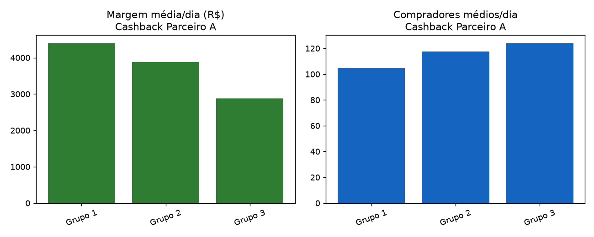

# Relatório de Teste A/B — Cashback Parceiro A

**Parceiro:** Parceiro A  
**Período analisado:** 2011-01-01 a 2011-04-02 (92 dias)  
**Grupos comparados:** 3 (Grupo 1, Grupo 2, Grupo 3)  
**Arquivo fonte:** `dataset_01_parceiroA.csv`  
**Gerado em:** 2026-07-15 13:18  

## Sobre o teste
Teste de 3 níveis de cashback no Parceiro A.

## Recomendação

### Escalar **Grupo 1** para 100% do tráfego.

**Por quê:**
- O baseline ('Grupo 1') já é a variante com maior margem média por dia (R$ 4,399.03). Nenhuma outra variante superou ele em margem, então não existe vantagem alguma pra provar estatisticamente.
- Margem/dia -- Grupo 1 (baseline) vs Grupo 2: diferença de R$ -512.96/dia (-11.7%), NÃO significativa (p_welch=0.1315, p_mannwhitney=0.1450).
- Margem/dia -- Grupo 1 (baseline) vs Grupo 3: diferença de R$ -1,526.35/dia (-34.7%), estatisticamente significativa (p_welch=0.0000, p_mannwhitney=0.0000).

**Trade-offs que valem a pena o gestor saber:**
- 'Grupo 1' vende significativamente MENOS GMV/dia do que 'Grupo 3' (diferença de -12,833.51/dia). Ou seja, a variante mais lucrativa também é a que traz menos volume -- vale o gestor pesar se o objetivo agora é lucro ou crescimento/alcance.

**Ressalvas / limites dessa análise:**
- Os dados são agregados por dia, não por usuário -- os testes estatísticos comparam as séries diárias entre variantes. É uma aproximação razoável quando a divisão de tráfego entre grupos é estável ao longo do teste, mas não substitui um teste no nível de usuário.
- Essa análise não modela sazonalidade (dia da semana, feriado, campanha concorrente rodando ao mesmo tempo) nem efeito de longo prazo do cashback sobre retenção/LTV -- só olha pro período em que o teste rodou.

## Resumo por grupo

| Grupo | Dias | Compradores/dia | GMV/dia | Comissão total | Cashback total | Margem total | Margem/dia | Ticket médio | Taxa de cashback | Take rate | ROI do cashback |
|---|---|---|---|---|---|---|---|---|---|---|---|
| **Grupo 1** | 92 | 104.7 | R$ 60.925,79 | R$ 638.135,00 | R$ 233.424,00 | R$ 404.711,00 | R$ 4.399,03 | R$ 581,87 | 4.16% | 11.38% | 2.73x |
| **Grupo 2** | 92 | 117.5 | R$ 69.816,26 | R$ 728.178,00 | R$ 370.659,00 | R$ 357.519,00 | R$ 3.886,08 | R$ 593,96 | 5.77% | 11.34% | 1.96x |
| **Grupo 3** | 92 | 124.0 | R$ 73.759,30 | R$ 767.887,00 | R$ 503.600,00 | R$ 264.287,00 | R$ 2.872,68 | R$ 594,73 | 7.42% | 11.32% | 1.52x |

## Testes de significância

### Margem diária (comissão − cashback) — a métrica que decide
| Comparação | Média baseline | Média variante | Diferença | Diferença % | p (Welch) | p (Mann-Whitney) | Significativo (95%)? | IC 95% da diferença |
|---|---|---|---|---|---|---|---|---|
| Grupo 1 vs Grupo 2 | 4,399.03 | 3,886.08 | -512.96 | -11.7% | 0.1315 | 0.1450 | Não | [-1,191.16; 122.46] |
| Grupo 1 vs Grupo 3 | 4,399.03 | 2,872.68 | -1,526.35 | -34.7% | 0.0000 | 0.0000 | Sim | [-2,118.45; -968.70] |

### Compradores por dia (volume)
| Comparação | Média baseline | Média variante | Diferença | Diferença % | p (Welch) | p (Mann-Whitney) | Significativo (95%)? | IC 95% da diferença |
|---|---|---|---|---|---|---|---|---|
| Grupo 1 vs Grupo 2 | 104.71 | 117.54 | 12.84 | 12.3% | 0.1349 | 0.1102 | Não | [-4.04; 29.00] |
| Grupo 1 vs Grupo 3 | 104.71 | 124.02 | 19.32 | 18.4% | 0.0339 | 0.0638 | Não | [1.66; 36.29] |

### GMV (vendas totais) por dia
| Comparação | Média baseline | Média variante | Diferença | Diferença % | p (Welch) | p (Mann-Whitney) | Significativo (95%)? | IC 95% da diferença |
|---|---|---|---|---|---|---|---|---|
| Grupo 1 vs Grupo 2 | 60,925.79 | 69,816.26 | 8,890.47 | 14.6% | 0.0863 | 0.1074 | Não | [-1,202.71; 18,711.30] |
| Grupo 1 vs Grupo 3 | 60,925.79 | 73,759.30 | 12,833.51 | 21.1% | 0.0196 | 0.0297 | Sim | [2,415.46; 23,059.97] |

## Qualidade dos dados

- Linhas lidas: 276 | Linhas válidas depois da limpeza: 276
- Não encontrei nenhum problema de qualidade nesse dataset.

---
_Relatório gerado automaticamente pela solução de análise de testes A/B de cashback._