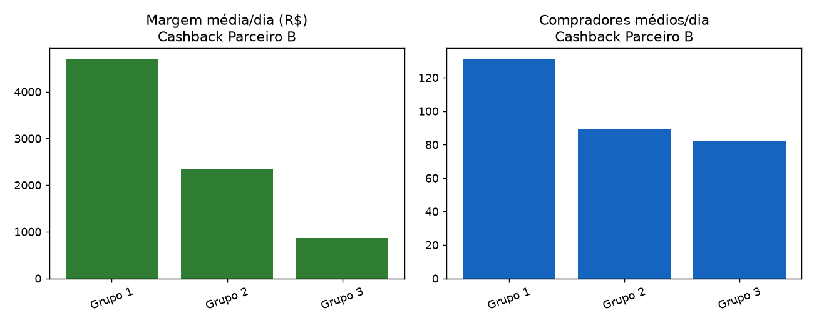

# Relatório de Teste A/B — Cashback Parceiro B

**Parceiro:** Parceiro B  
**Período analisado:** 2011-05-01 a 2011-06-30 (61 dias)  
**Grupos comparados:** 3 (Grupo 1, Grupo 2, Grupo 3)  
**Arquivo fonte:** `dataset_02_parceiroB.csv`  
**Gerado em:** 2026-07-15 13:43  

## Sobre o teste
Teste do uso do Git com o Google Sheets

## Recomendação

### Escalar **Grupo 1** para 100% do tráfego.

**Por quê:**
- O baseline ('Grupo 1') já é a variante com maior margem média por dia (R$ 4,697.87). Nenhuma outra variante superou ele em margem, então não existe vantagem alguma pra provar estatisticamente.
- Margem/dia -- Grupo 1 (baseline) vs Grupo 2: diferença de R$ -2,351.03/dia (-50.0%), estatisticamente significativa (p_welch=0.0000, p_mannwhitney=0.0000).
- Margem/dia -- Grupo 1 (baseline) vs Grupo 3: diferença de R$ -3,835.69/dia (-81.6%), estatisticamente significativa (p_welch=0.0000, p_mannwhitney=0.0000).

**Ressalvas / limites dessa análise:**
- Os dados são agregados por dia, não por usuário -- os testes estatísticos comparam as séries diárias entre variantes. É uma aproximação razoável quando a divisão de tráfego entre grupos é estável ao longo do teste, mas não substitui um teste no nível de usuário.
- Essa análise não modela sazonalidade (dia da semana, feriado, campanha concorrente rodando ao mesmo tempo) nem efeito de longo prazo do cashback sobre retenção/LTV -- só olha pro período em que o teste rodou.

## Resumo por grupo

| Grupo | Dias | Compradores/dia | GMV/dia | Comissão total | Cashback total | Margem total | Margem/dia | Ticket médio | Taxa de cashback | Take rate | ROI do cashback |
|---|---|---|---|---|---|---|---|---|---|---|---|
| **Grupo 1** | 61 | 131.0 | R$ 67.111,77 | R$ 450.321,00 | R$ 163.751,00 | R$ 286.570,00 | R$ 4.697,87 | R$ 512,37 | 4.00% | 11.00% | 2.75x |
| **Grupo 2** | 61 | 89.4 | R$ 46.934,74 | R$ 314.935,00 | R$ 171.778,00 | R$ 143.157,00 | R$ 2.346,84 | R$ 525,13 | 6.00% | 11.00% | 1.83x |
| **Grupo 3** | 61 | 82.4 | R$ 43.114,15 | R$ 289.290,00 | R$ 236.697,00 | R$ 52.593,00 | R$ 862,18 | R$ 522,96 | 9.00% | 11.00% | 1.22x |

## Testes de significância

### Margem diária (comissão − cashback) — a métrica que decide
| Comparação | Média baseline | Média variante | Diferença | Diferença % | p (Welch) | p (Mann-Whitney) | Significativo (95%)? | IC 95% da diferença |
|---|---|---|---|---|---|---|---|---|
| Grupo 1 vs Grupo 2 | 4,697.87 | 2,346.84 | -2,351.03 | -50.0% | 0.0000 | 0.0000 | Sim | [-2,931.00; -1,824.37] |
| Grupo 1 vs Grupo 3 | 4,697.87 | 862.18 | -3,835.69 | -81.6% | 0.0000 | 0.0000 | Sim | [-4,371.59; -3,392.57] |

### Compradores por dia (volume)
| Comparação | Média baseline | Média variante | Diferença | Diferença % | p (Welch) | p (Mann-Whitney) | Significativo (95%)? | IC 95% da diferença |
|---|---|---|---|---|---|---|---|---|
| Grupo 1 vs Grupo 2 | 130.98 | 89.38 | -41.61 | -31.8% | 0.0000 | 0.0000 | Sim | [-58.46; -25.62] |
| Grupo 1 vs Grupo 3 | 130.98 | 82.44 | -48.54 | -37.1% | 0.0000 | 0.0000 | Sim | [-64.15; -33.96] |

### GMV (vendas totais) por dia
| Comparação | Média baseline | Média variante | Diferença | Diferença % | p (Welch) | p (Mann-Whitney) | Significativo (95%)? | IC 95% da diferença |
|---|---|---|---|---|---|---|---|---|
| Grupo 1 vs Grupo 2 | 67,111.77 | 46,934.74 | -20,177.03 | -30.1% | 0.0000 | 0.0000 | Sim | [-29,113.18; -11,478.19] |
| Grupo 1 vs Grupo 3 | 67,111.77 | 43,114.15 | -23,997.62 | -35.8% | 0.0000 | 0.0000 | Sim | [-32,530.24; -15,976.43] |

## Qualidade dos dados

- Linhas lidas: 183 | Linhas válidas depois da limpeza: 183
- Não encontrei nenhum problema de qualidade nesse dataset.

---
_Relatório gerado automaticamente pela solução de análise de testes A/B de cashback._