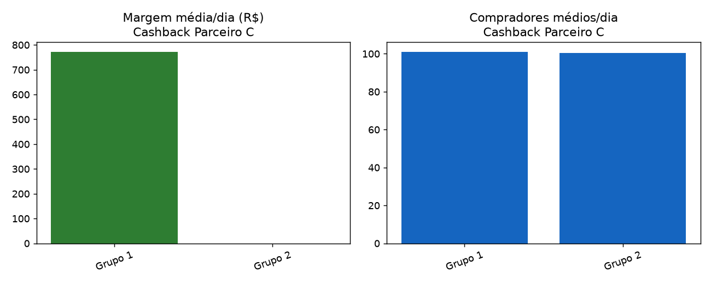

# Relatório de Teste A/B — Cashback Parceiro C

**Parceiro:** Parceiro C  
**Período analisado:** 2011-07-01 a 2011-08-14 (45 dias)  
**Grupos comparados:** 2 (Grupo 1, Grupo 2)  
**Arquivo fonte:** `dataset_03_parceiroC.csv`  
**Gerado em:** 2026-07-15 13:18  

## Sobre o teste
...

## Recomendação

### Escalar **Grupo 1** para 100% do tráfego.

**Por quê:**
- O baseline ('Grupo 1') já é a variante com maior margem média por dia (R$ 772.64). Nenhuma outra variante superou ele em margem, então não existe vantagem alguma pra provar estatisticamente.
- Margem/dia -- Grupo 1 (baseline) vs Grupo 2: diferença de R$ -772.64/dia (-100.0%), estatisticamente significativa (p_welch=0.0000, p_mannwhitney=0.0000).

**Ressalvas / limites dessa análise:**
- Os dados são agregados por dia, não por usuário -- os testes estatísticos comparam as séries diárias entre variantes. É uma aproximação razoável quando a divisão de tráfego entre grupos é estável ao longo do teste, mas não substitui um teste no nível de usuário.
- Essa análise não modela sazonalidade (dia da semana, feriado, campanha concorrente rodando ao mesmo tempo) nem efeito de longo prazo do cashback sobre retenção/LTV -- só olha pro período em que o teste rodou.

## Resumo por grupo

| Grupo | Dias | Compradores/dia | GMV/dia | Comissão total | Cashback total | Margem total | Margem/dia | Ticket médio | Taxa de cashback | Take rate | ROI do cashback |
|---|---|---|---|---|---|---|---|---|---|---|---|
| **Grupo 1** | 45 | 101.1 | R$ 38.632,44 | R$ 121.693,00 | R$ 86.924,00 | R$ 34.769,00 | R$ 772,64 | R$ 382,16 | 5.00% | 7.00% | 1.40x |
| **Grupo 2** | 45 | 100.5 | R$ 37.449,67 | R$ 117.967,00 | R$ 117.967,00 | R$ 0,00 | R$ 0,00 | R$ 372,67 | 7.00% | 7.00% | 1.00x |

## Testes de significância

### Margem diária (comissão − cashback) — a métrica que decide
| Comparação | Média baseline | Média variante | Diferença | Diferença % | p (Welch) | p (Mann-Whitney) | Significativo (95%)? | IC 95% da diferença |
|---|---|---|---|---|---|---|---|---|
| Grupo 1 vs Grupo 2 | 772.64 | 0.00 | -772.64 | -100.0% | 0.0000 | 0.0000 | Sim | [-828.98; -714.20] |

### Compradores por dia (volume)
| Comparação | Média baseline | Média variante | Diferença | Diferença % | p (Welch) | p (Mann-Whitney) | Significativo (95%)? | IC 95% da diferença |
|---|---|---|---|---|---|---|---|---|
| Grupo 1 vs Grupo 2 | 101.09 | 100.49 | -0.60 | -0.6% | 0.9218 | 0.8559 | Não | [-12.64; 11.20] |

### GMV (vendas totais) por dia
| Comparação | Média baseline | Média variante | Diferença | Diferença % | p (Welch) | p (Mann-Whitney) | Significativo (95%)? | IC 95% da diferença |
|---|---|---|---|---|---|---|---|---|
| Grupo 1 vs Grupo 2 | 38,632.44 | 37,449.67 | -1,182.78 | -3.1% | 0.6347 | 0.7225 | Não | [-5,983.67; 3,577.97] |

## Qualidade dos dados

- Linhas lidas: 90 | Linhas válidas depois da limpeza: 90
- Não encontrei nenhum problema de qualidade nesse dataset.

---
_Relatório gerado automaticamente pela solução de análise de testes A/B de cashback._